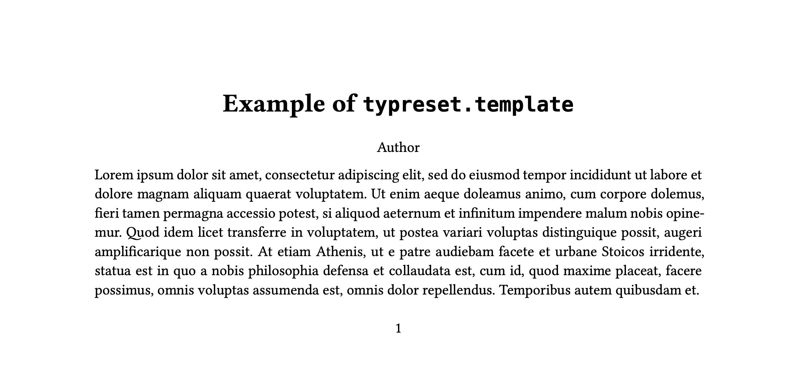
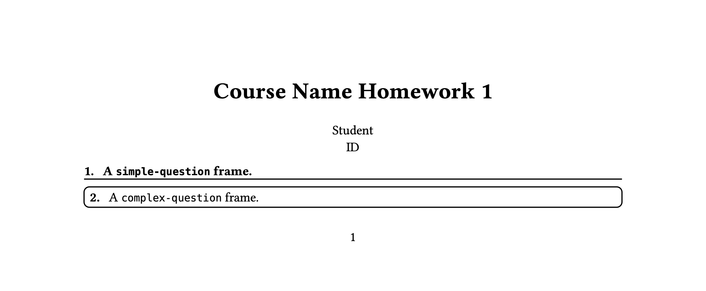

# Typreset (W.I.P.)

A collection of [Typst](https://typst.app) presets to provide a starting point for your writing.

Available presets:

- `set-font()`: Chinese & English Font support.
- `typesetting`: A typesetting preset.
- `template`: A template for writing a document.
- `homework`: Homework template and `simple-question` and `complex-question` frame to write your homework.

There are some manuals/docs in the `docs` folder.

## Usage

Typrest supports Typst 0.12.0 and newer.

At this time there is no release of this project. You need to manually configure your local Typst packages.

- Clone this project to `{data-dir}/typst/packages/local/typreset/0.1.0`, where `data-dir` [depends on your systems](https://github.com/typst/packages#local-packages). For example, in Linux, it is `~/.local/share/typst/packages/local/typreset/0.1.0`:

  ```bash
  mkdir -p ~/.local/share/typst/packages/local/typreset/
  git clone https://github.com/Fr4nk1inCs/typreset.git ~/.local/share/typst/packages/local/typreset/0.2.0
  ```

Then you can use the presets in your Typst project:

```typ
#import "@local/typreset:0.2.0": *
```

## Examples

### Basic Template

```typ
#import "@local/typreset:0.2.0": template

#set page(height: auto)
#show: template.with(
  title: ("Example of typreset.template", [Example of `typreset.template`]),
  author-infos: "Author"
)

#lorem(100)
```



For more examples, please see [`docs/template.pdf`](./docs/template.pdf).

### Homework

```typ
#import "@local/typreset:0.2.0": homework

#set page(height: auto)
#show: homework.template.with(
  course: "Course Name",
  number: 1,
  student-infos: ((name: "Student", id: "ID"),),
)

#homework.simple-question[
  A `simple-question` frame.
]

#homework.complex-question[
  A `complex-question` frame.
]
```



For more examples, please see [`docs/homework-template.pdf`](./docs/homework.pdf).
